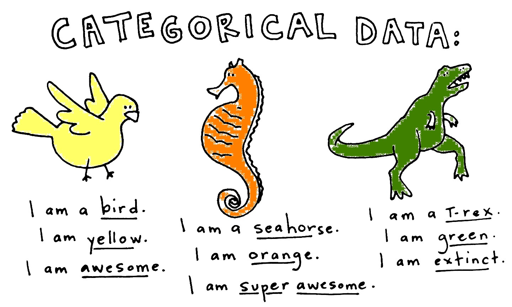

<!-- $theme: default -->

# Working with real data

---

# Working with real data

## Agenda

### 1. Dealing with categorical variables
### 2. Feature scaling

---

# Dealing with categorical variables

## Categorical variables

Categorical or nominal variables assign each observation to a given category, on the basis of some qualitative property or label.

A categorical variable that can take on exactly two values is a binary variable.

The machine learning algorithms we use tend to want numbers, not strings, as inputs.

---



---

# Dealing with categorical variables

## Categorical data

The term is commonly applied to data sets containing  categorical and non-categorical variables.

---

# Dealing with categorical variables

## Ordinal variables

Ordinal variables are categorical variables that have natural, ordered categories, and the distance between categories is not known.

The ordinal scale is different from the nominal scale, by having a set  of ordered categories.

---

# Dealing with categorical variables

## Label encoding

Label encoding, in short, means encoding labels with values from 0 and n - 1.

This assumes that not only there is an ordinal scale, but also that all labels are on a scale with constant intervals.

Label encoding transforms non-numerical labels to numerical.

It can also be used to normalize numerical labels.

---

# Dealing with categorical variables

## Label encoding with `pandas.factorize`

```python
import pandas as pd

def encode_labels_in_data_frame(data, cols):

    data[cols] = data[cols].apply(
        lambda x: pd.factorize(x)[0])
    
    return data


cols = ['cols', 'to', 'be', 'encoded']
encode_labels_in_data_frame(data, cols)
```

---

# Dealing with categorical variables

## Label encoding with `sklearn`'s `LabelEncoder`

```python
from sklearn.preprocessing import LabelEncoder

def encode_labels_in_data_frame(data, cols):

    encoder = LabelEncoder()
    
    data[cols] = data[cols].apply(encoder.fit_transform)
    
    return data


cols = ['cols', 'to', 'be', 'encoded']
encode_labels_in_data_frame(data, cols)
```

---

# Dealing with categorical variables

## Binary encoding with `sklearn`'s `LabelBinarizer`

```python
from sklearn.preprocessing import LabelBinarizer

def encode_binary_labels_in_data_frame(data, cols):

    encoder = LabelBinarizer()
    
    data[cols] = data[cols].apply(encoder.fit_transform)
    
    return data


cols = ['cols', 'to', 'be', 'encoded']
encode_labels_in_data_frame(data, cols)
```

---

# Dealing with categorical variables

## One-hot or dummy encoding

Most categorical variables are not ordinal, however.

This means that there's no natural order to labels, and the distance between them is not known. You would be treating qualitative data the same way you would treat continuous data.

The response to this is the creation of dummy variables.

Dummy variables take the value of 0 or 1 to indicate the absence or presence of some category or label.

---

# Dealing with categorical variables

## The curse of dimensionality

After overfitting, the biggest problem in machine learning is the curse of dimensionality: in high-dimensional spaces, things stop working.

The curse of dimensionality arises with high-dimensional spaces.

High-dimensional feature spaces require more training data to ensure that there are several samples with each combination of values  (input space).

With a fixed number of training samples the predictive power reduces as the dimensionality increases (aka Hughes Phenomenon).

---

# Dealing with categorical variables

## The curse of dimensionality

If the number of rows in a data set is fixed, and we are adding more  columns (dimensions) without extra information we can hurt model performance.

This is more true when we lack samples in each category.

---

# Dealing with categorical variables

## Dummy encoding with `pandas.get_dummies`

```python
import pandas as pd

def dummy_encode_labels_in_data_frame(data, cols):
    
    data = pd.get_dummies(data, columns=cols)
    
    return data
   
   
cols = ['cols', 'to', 'be', 'dummy', 'encoded']
dummy_encode_labels_in_data_frame(data, cols)    
```
---

# Dealing with categorical variables

## Dummy encoding with `sklearn`'s `OneHotEncoder`

```python
from sklear.preprocessing import OneHotEncoder

def hot_encode_labels_in_data_frame(data, cols):

    encoder = OneHotEncoder(categorical_features=all)
    
    data[cols] = encoder.fit_transform(data[cols])
    
    return data


cols = ['cols', 'to', 'be', 'dummy', 'encoded']
hot_encode_labels_in_data_frame(data, cols)
```
---

# Dealing with categorical variables

## `get_dummies` vs. `OneHotEncoder`

* `OneHotEncoder` don't process strings directly (you need to label encode them first using the `LabelEncoder`)
* `get_dummies`, on the other end, can be used with other types
* Use `drop_first=True` with `get_dummies` (avoid collinearity)
* `sklearn`'s encoders can be used in scikit-learn pipelines

---

# Feature scaling

## Why feature scaling

To avoid attributes in greater numeric ranges dominating those in the smaller numeric ranges.

Many classifiers, for example, calculate the distance between points, and if one of the features has a broader range, will govern distance.

Also, normalization is key in most optimization problems; e.g. such an algorithm as gradient descent converges faster.

---

# Feature scaling

## Why feature scaling

This way, each feature contributes approximately proportionally to the final distance.

---

# Feature scaling

## Rescaling data with `sklearn`'s `MinMaxScaler`

* Rescale the data into the range between 0 and 1

```python
from sklearn.preprocessing import MinMaxScaler

def scale_features_in_data_frame(data, cols):

    scaler = MinMaxScaler()
    
    data[cols] = scaler.fit_transform(data[cols])
    
    return data

cols = ['cols', 'to', 'be', 'rescaled']
scale_features_in_data_frame(data, cols)
```

---

# Feature scaling

## Stardardizing with `sklearn`'s `StandardScaler`

* Standardize by removing the mean and scaling to unit variance
* Assumes somewhat normally distributed data

```python
from sklearn.preprocessing import StandardScaler

def standardize_features_in_data_frame(data, cols):

    scaler = StandardScaler()
    
    data[cols] = scaler.fit_transform(data[cols])
    
    return data


cols = ['cols', 'to', 'be', 'standardized']
standardize_features_in_data_frame(data, cols)
```

---

# Feature scaling

## Rescaling data with `sklearn`'s `Normalizer`

* Normalize samples individually to unit norm (length 1)
* Divides each component by the Euclidean length of the vector

```python
from sklearn.preprocessing import Normalizer

def normalize_features_in_data_frame(data, cols):

    scaler = Normalizer()
    
    data[cols] = scaler.fit_transform(data[cols])
    
    return data


cols = ['cols', 'to', 'be', 'normalized']
normalize_features_in_data_frame(data, cols)
```

---

# Feature scaling

## Binarizing data with `sklearn`'s `Binarizer`

* Set feature values to 0 or 1 according to a threshold

```python
def binarize_features_in_data_frame(data, cols):

    scaler = Binarizer(threshold=.5)
    
    data[cols] = scale.fit_transform(data[cols])
    
    return data
    

cols = ['cols', 'to', 'be', 'binarized']
normalize_features_in_data_frame(data, cols)
```
---